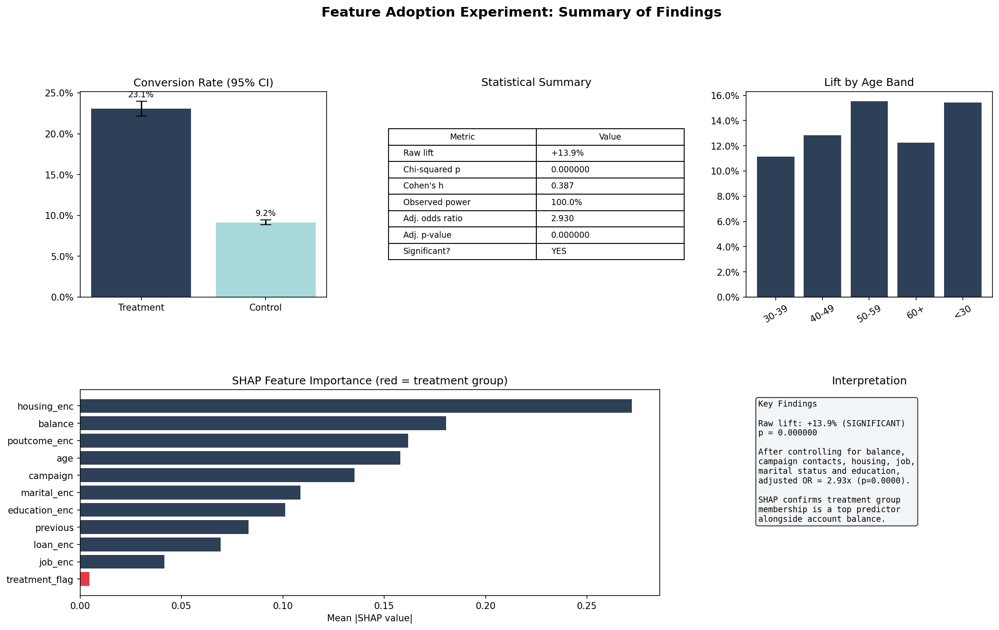

# Feature Adoption Experiment Analysis

**Customers contacted in a prior campaign convert at 2.5x the rate of customers who weren't. The effect holds after adjusting for measured covariates, across age bands, and across job types.**

A walk through the full analytical lifecycle for an observational "experiment" where the groups aren't actually random: balance checking, significance testing, covariate adjustment, segmentation with multiple testing correction, SHAP explainability, and drift monitoring.

**Stack**: Python · scipy · statsmodels · scikit-learn · SHAP · Evidently · uv

The infrastructure choices are deliberate: a generator-based streaming ingest simulates chunk-by-chunk Kafka consumption so the same code could run on a live event feed. Forty-four tests run without any network calls, so the pipeline is fully reproducible from a clean clone.

---

## Headline findings

- **The raw lift is 13.9 percentage points.** Treatment customers (prior contact) converted at 23.1%, control customers at 9.2%. The gap is large, consistent, and the test has 100% observed power.
- **The effect isn't a selection artifact.** Treatment customers differ from control on age, balance, housing status, and job, so a raw comparison overstates the effect. After adjusting for every imbalanced covariate in a logistic regression, the odds ratio is 2.93x (p < 0.001). The lift survives covariate adjustment but I can't rule out unmeasured confounders.
- **The lift isn't driven by a single subgroup.** Segmentation across age bands and job types with Benjamini-Hochberg correction (controlling false discovery rate) shows the effect is present across the population, not concentrated in one demographic slice.
- **Treatment is one signal in a behavioral profile, not a standalone cause.** SHAP ranks the treatment flag 12th of 12 features in the gradient boosting model. The model is leaning on balance, campaign count, and job because those features describe the same kind of engaged customer the treatment flag identifies. This is expected in an observational study and reinforces why covariate adjustment matters.

---

## The question

Does contacting a customer in a previous campaign actually cause them to be more likely to subscribe to a new product, or do prior-contact customers just look different from never-contacted customers in ways that already make them more likely to convert?

Most campaign analytics stops at "people who got the call converted more often, so calling works." That answer leaks selection bias. This pipeline takes the harder approach: assume nothing about whether the groups are comparable, check the assumptions, adjust for what you can measure, and report the effect that's left.

---

## Data

- **Source**: UCI Bank Marketing dataset (`fetch_ucirepo(id=222)`)
- **Size**: 45,211 records, 17 features
- **Treatment definition**: customers with prior campaign contact (`previous > 0`)
- **Control definition**: customers with no prior campaign contact
- **Outcome**: subscribed to a term deposit (`y == 'yes'`)

### Why this isn't a real experiment

Treatment customers weren't randomly assigned. They self-selected by being reachable in a prior campaign, which means they probably differ from control customers on traits the bank didn't randomize over. That's why the balance check happens before any inference and the logistic regression controls for measured imbalances. Even with adjustment, this is causal-flavored observational analysis, not a randomized A/B test.

### The post-treatment variable trap

The dataset includes `duration` (call length in seconds), which is recorded after the conversion outcome is known. Including it in a model would leak the answer and inflate every metric. It's excluded from all significance tests and models throughout the pipeline. The README mentions this explicitly because post-treatment variable leakage is one of the most common ways A/B analyses go wrong in production settings.

---

## Methods

The pipeline runs in four steps, each with its own analysis module and entry script.

**Step 1: Balance check.** T-tests on numeric features and chi-squared tests on categoricals verify (or refute) group comparability before any inference. This step is what tells you whether you're allowed to compare the raw means at all.

**Step 2: Significance testing.** Chi-squared test for the main effect, 95% confidence intervals on the lift, Cohen's h for effect size, observed power calculation, segmentation across age bands and job types with Benjamini-Hochberg multiple testing correction, and a logistic regression adjusting for every imbalanced covariate from Step 1.

**Step 3: SHAP explainability.** A `GradientBoostingClassifier` is trained to predict conversion. SHAP values rank feature contributions globally and at the individual level. The point isn't to use this as the production model but to understand which features the data thinks matter.

**Step 4: Drift detection.** The dataset is split into reference (first 60%) and current (last 40%) periods. Evidently compares feature distributions and model predictions across periods. No meaningful drift is detected over the observation window, which is expected for a stable historical dataset but is worth confirming before any of this gets deployed.

---

## Full results

| Metric | Value |
|--------|-------|
| Treatment conversion rate | 23.1% |
| Control conversion rate | 9.2% |
| Raw lift | +13.9 pp |
| Chi-squared p-value | < 0.001 |
| Cohen's h (effect size) | 0.387 (medium, meaning the effect is large enough to matter in practice, not just statistically detectable) |
| Observed power | 100% |
| Adjusted odds ratio (logistic regression) | 2.93x |
| Adjusted p-value | < 0.001 |



---

## On the EU AI Act framing

This is observational analysis of an existing campaign, not a deployed automated decision system, so EU AI Act compliance isn't directly required here. But if these findings informed a production targeting model that decided which customers to call, Article 86 (right to explanation for automated decisions) would apply. The SHAP layer in Step 3 is the kind of infrastructure that makes Article 86 compliance possible. Building it into the analysis pipeline rather than bolting it on later is the right pattern.

---

## Project structure

```
src/
    pipeline.py              # streaming ingest, transform, encode (shared by all modules)
    analysis/
        balance.py
        significance.py
        shap.py
        drift.py
        summary.py
scripts/                     # thin entry points, one per pipeline stage
outputs/                     # generated charts and HTML reports
tests/                       # 44 tests, no network calls
```

---

## How to run

**Setup**

```bash
git clone https://github.com/mychellehale/fintech-ab-experiment.git
cd fintech-ab-experiment
uv sync
```

**Run the full pipeline**

```bash
python -m scripts.run_balance_check
python -m scripts.run_significance
python -m scripts.run_shap
python -m scripts.run_drift
python -m scripts.run_summary
```

**Run the tests**

```bash
pytest tests/
```

---

## Future work

- **Sensitivity analysis for unmeasured confounding.** Rosenbaum bounds or E-values would quantify how strong an unmeasured confounder would need to be to nullify the adjusted effect. This is the natural next step for an observational study claiming causal-flavored findings.
- **Propensity score methods.** Inverse probability weighting or matching as an alternative to regression adjustment, to triangulate the effect estimate using a different identification strategy.
- **A real randomized experiment.** All of this analysis is observational. The strongest version of this question would come from running an actual A/B test on a new campaign with random assignment to treatment and control arms.